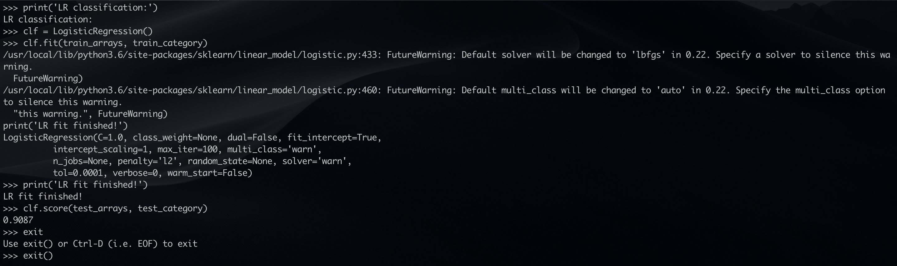

# Text classification

## Intro

A simple Chinese text classfication which is based on doc2vec. Datas are all news(100 words to 2,000 words mainly) in 10 categories. 50,000 for training and 10,000 for testing.

1. Word segmentation is handled mainly by [jieba](https://github.com/fxsjy/jieba). 
2. Use [gensim-doc2vec](https://radimrehurek.com/gensim/models/doc2vec.html) to converts documents to vectors.
3. [scikit-learn](https://scikit-learn.org) for classification.

Accuracy 90.87%

